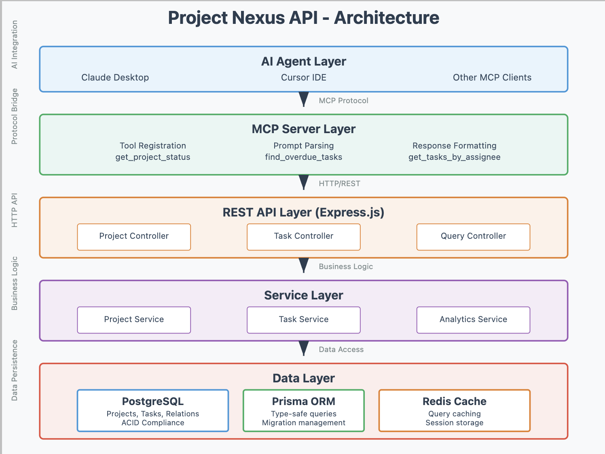

# Project Tracker API with MCP Integration

A TypeScript-based REST API for project and task management with MCP (Model Context Protocol) integration.

## Technology Stack

- Node.js 18+ with TypeScript
- Express.js framework
- PostgreSQL with Prisma ORM
- Zod for validation
- Jest for testing
- Swagger/OpenAPI for documentation
- MCP SDK for agent integration

## Project Structure

```
project-tracker-api/
├── src/
│   ├── controllers/     # API route handlers
│   ├── services/        # Business logic layer
│   ├── models/         # Database models/schemas
│   ├── middleware/     # Validation, error handling
│   ├── utils/         # Helper functions
│   ├── mcp/          # MCP server implementation
│   └── config/       # Database and app configuration
├── prisma/           # Database schema and migrations
├── tests/           # Unit and integration tests
├── docs/           # API documentation and diagrams
└── scripts/       # Setup and seed scripts
```

## Architecture Overview



## Getting Started

1. Clone the repository
2. Install dependencies:
   ```bash
   npm install
   ```
3. Copy `.env.example` to `.env` and update the values
4. Initialize the database:
   ```bash
   npm run prisma:generate
   npm run prisma:migrate
   ```
5. Start the development server:
   ```bash
   npm run dev
   ```

## Available Scripts

- `npm run dev` - Start development server with hot reload
- `npm run build` - Build for production
- `npm start` - Start production server
- `npm run lint` - Run ESLint
- `npm run format` - Format code with Prettier
- `npm test` - Run tests
- `npm run test:coverage` - Run tests with coverage report
- `npm run prisma:generate` - Generate Prisma client
- `npm run prisma:migrate` - Run database migrations
- `npm run prisma:studio` - Open Prisma Studio

## API Documentation

Once the server is running, visit `/api/docs` for the Swagger documentation.

## MCP Integration

The API includes MCP tools for:
- Project status queries
- Task management
- Resource allocation
- Progress tracking

## Testing

```bash
# Run all tests
npm test

# Run tests in watch mode
npm run test:watch

# Generate coverage report
npm run test:coverage
```

## Contributing

1. Create a feature branch
2. Make your changes
3. Run tests and linting
4. Submit a pull request

## License

ISC 